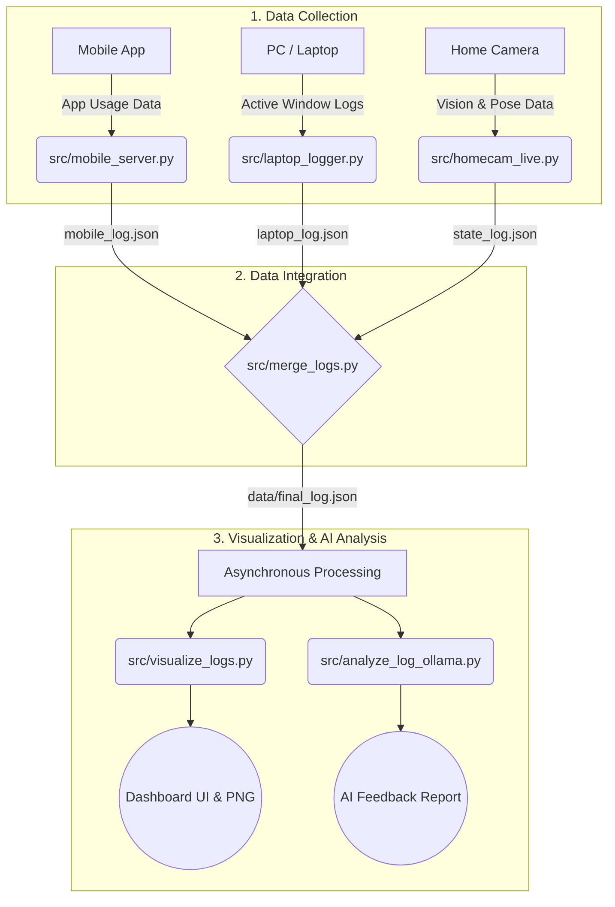

# 거주 공간 내 활동 패턴 분석 시스템

본 프로젝트는 컴퓨터 비전 기술을 활용하여 사용자의 일상 활동을 실시간으로 추적하고, 이를 모바일 및 PC의 디지털 기기 사용 로그와 통합하여 종합적인 라이프스타일 분석 리포트를 제공하는 시스템입니다.

## 주요 기능
- **실시간 활동 추적:** MediaPipe와 YOLOv8을 활용하여 사용자의 물리적 자세(앉음, 서있음, 누움 등) 및 특정 구역 체류 시간을 실시간으로 인식합니다.
- **크로스 플랫폼 로그 통합:** 비전 데이터(카메라), PC 앱 사용 기록(윈도우 로거), 모바일 앱 사용 기록(안드로이드 통신)을 초 단위로 동기화하여 병합합니다.
- **비동기 시각화 및 AI 분석:** 수집된 데이터를 바탕으로 라이프스타일 대시보드(파이/바 차트)를 화면에 띄움과 동시에, 백그라운드에서 로컬 LLM이 즉각적인 행동 분석 코멘트를 생성하여 제공합니다.

## 기술 스택
- **언어:** Python, Java, Kotlin
- **AI/Vision:** YOLOv8, MediaPipe (Human Pose Estimation)
- **LLM:** Ollama(Local Ai)
- **Mobile:** Android (Jetpack Compose)
- **개발 환경:** Git, GitHub, VS Code

## 프로젝트 구조
```text
Capstone-Project/
├── README.md                     # 프로젝트 설명서
├── requirements.txt              # 파이썬 실행을 위한 필수 라이브러리 목록
├── run_system.py                 # 통합 시스템 전체 실행 진입점 (Main 오케스트라)
├── src/                          # 핵심 구동 스크립트 폴더
│   ├── analyze_log_gemini.py     # Gemini API 활용 로그 분석
│   ├── analyze_log_gpt.py        # GPT API 활용 로그 분석
│   ├── analyze_log_ollama.py     # Ollama(로컬 AI) 활용 라이프스타일 종합 분석
│   ├── homecam_live.py           # 홈캠 실시간 영상 처리, 자세 추적 및 로깅 방어 코드
│   ├── laptop_logger.py          # PC 사용 시간 및 포그라운드/백그라운드 활동 기록기
│   ├── merge_logs.py             # 다중 소스(모바일, PC, 홈캠) 데이터 시간대별 병합 처리
│   ├── mobile_server.py          # 안드로이드 앱 통신 및 모바일 로그 수신용 Flask 서버
│   └── visualize_logs.py         # 병합된 로그 기반 3분할 통합 대시보드 시각화 도구
├── data/                         # 동적 데이터 및 결과물 저장 폴더 (초기화 및 자동 생성)
│   ├── *_log.json                # 실시간 수집 및 병합된 각종 JSON 로그 파일
│   └── dashboard.png             # 최종 생성된 분석 대시보드 스크린샷 이미지
└── models/                       # AI 모델 파일 폴더
    └── yolov8n.pt                # YOLOv8 객체 인식 모델 파일
```

## 시스템 동작 흐름 (System Pipeline)

본 프로젝트는 데이터 수집부터 AI 분석, 그리고 결과 시각화까지 자동화된 파이프라인으로 구성되어 있습니다. 전체적인 시스템의 동작 과정은 다음과 같습니다.


