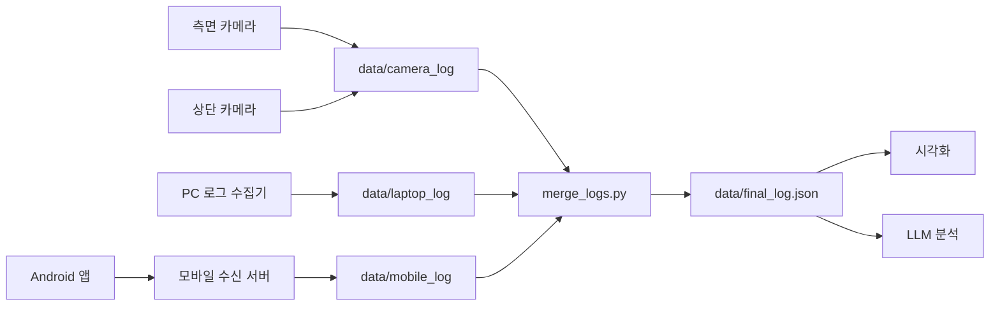

# 거주 공간 내 활동 패턴 분석 시스템

카메라로 사용자의 자세와 공간 내 행동을 추적하고, PC 및 Android 기기 사용 로그를 함께 수집하여 생활 패턴을 분석하는 캡스톤 프로젝트입니다.

## 현재 구현 기능

- **듀얼 카메라 분석**: 측면 카메라에서 자세를 분류하고, 상단 카메라에서 이동과 구역 체류를 추적합니다.
- **PC 사용 로그 수집**: 활성 창과 프로그램 사용 기록을 주기적으로 JSON 파일로 저장합니다.
- **Android 사용 로그 수집**: 포그라운드 서비스로 앱 사용 기록을 수집하고 Flask 서버로 전송합니다.
- **로그 통합**: 카메라·PC·모바일 로그를 시간 기준으로 병합합니다.
- **시각화 및 AI 분석**: 병합 로그를 대시보드로 시각화하고 GPT, Gemini, Gemma 또는 Ollama 기반 분석에 활용할 수 있습니다.

## 기술 스택

- Python, Kotlin
- OpenCV, MediaPipe, Ultralytics YOLO
- Flask
- Android Jetpack Compose
- Matplotlib
- OpenAI API, Gemini API, Ollama

## 프로젝트 구조

```text
Capstone-Project/
├── MobileLog/                    # Android 앱
├── data/                         # 실행 중 생성되는 로그와 분석 결과
│   ├── camera_log/               # 측면·상단 카메라 로그
│   ├── laptop_log/               # PC 사용 로그
│   └── mobile_log/               # Android 앱 사용 로그
├── models/                       # 모델 파일 보관 폴더
├── src/
│   ├── homecam2_side.py          # 측면 카메라 자세 및 행동 분석
│   ├── homecam2_top.py           # 상단 카메라 이동 및 구역 분석
│   ├── run_both_cameras.py       # 두 카메라 동시 실행
│   ├── laptop_logger.py          # PC 사용 로그 수집
│   ├── mobile_server.py          # 모바일 로그 수신 서버
│   ├── merge_logs.py             # 카메라·PC·모바일 로그 병합
│   ├── visualize_logs.py         # 통합 로그 시각화
│   └── analyze_log_*.py          # LLM 기반 로그 분석
├── tests/                        # 분류 및 구역 관리 테스트
├── requirements.txt
└── README.md
```

## 설치

Windows와 Python 가상환경 사용을 기준으로 합니다.

```bash
python -m venv venv
venv\Scripts\activate
pip install -r requirements.txt
```

Android 앱은 `MobileLog` 폴더를 Android Studio에서 열어 빌드합니다. 앱 사용 기록을 수집하려면 기기 설정에서 **사용정보 접근 허용** 권한을 승인해야 합니다.

## 실행 방법

프로젝트 루트(`Capstone-Project`)에서 필요한 수집기를 각각 실행합니다.

### 1. 듀얼 카메라 실행

```bash
python src/run_both_cameras.py
```

측면 또는 상단 카메라만 실행하려면 다음 명령을 사용합니다.

```bash
python src/homecam2_side.py
python src/homecam2_top.py
```

카메라 번호, 영상 경로와 구역 좌표는 각 카메라 스크립트의 설정값을 실행 환경에 맞게 조정해야 합니다. 실행 창에서 `q`를 누르면 분석을 종료하고 로그를 저장합니다.

### 2. PC 로그 수집

```bash
python src/laptop_logger.py
```

### 3. 모바일 로그 서버 실행

```bash
python src/mobile_server.py
```

서버는 기본적으로 `0.0.0.0:5000`에서 요청을 받습니다. Android 앱 화면에서 PC와 같은 네트워크의 서버 주소를 `http://PC_IP:5000` 형식으로 설정합니다. Windows 방화벽에서 5000번 포트의 접근 허용이 필요할 수 있습니다.

### 4. 수집 로그 병합

```bash
python src/merge_logs.py
```

병합 결과는 `data/final_log.json`에 저장됩니다.

### 5. 결과 시각화 및 분석

```bash
python src/visualize_logs.py
python src/analyze_log_ollama.py
```

다른 LLM을 사용하려면 해당 `analyze_log_*.py` 파일의 API 설정을 구성한 뒤 실행합니다.

## 데이터 흐름



## Git 관리 참고

학습 데이터, 실행 로그, 모델 가중치와 캐시 파일은 크기가 크거나 다시 생성될 수 있으므로 일반적으로 Git에 포함하지 않습니다. 필요한 설정 파일과 소스 코드만 선택하여 커밋하는 것을 권장합니다.
